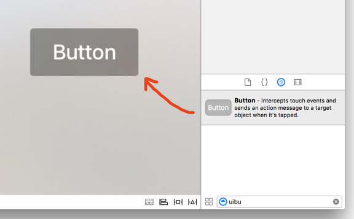
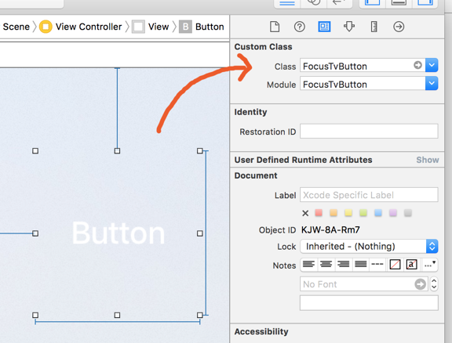
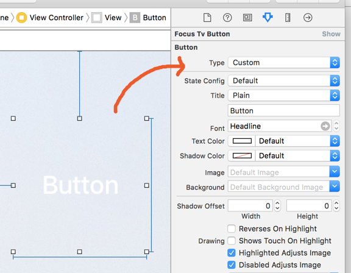
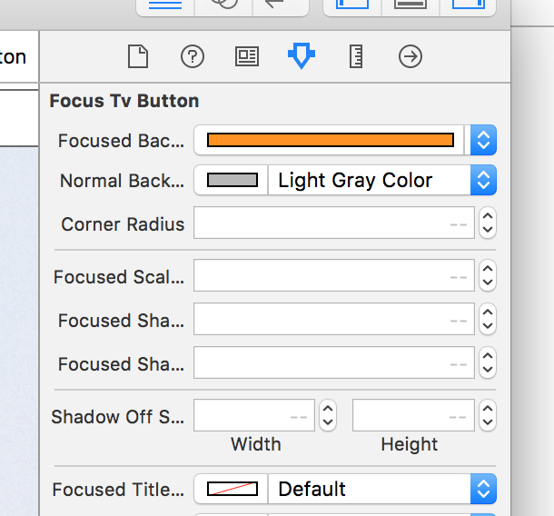

# FocusTvButton

Light wrapper of UIButton that allows extra customization for tvOS


If you would like to have the same level of customization in tableview cells, you should definitely check out [TvOSCustomizableTableViewCell](https://github.com/zattoo/TvOSCustomizableTableViewCell)

## Description

FocusTvButton allows the customization of UIButtons in tvOS, adding extra properties to customize layout attributes which are not customizable on UIButtons out of the box.

Custom properties:

- Focused background color
- Unfocused background color
- Corner radius
- Scale factor when focused
- Shadow radius when focused
- Shadow opacity when focused
- Shadow color
- Shadow offset when focused
- Duration of the focus animation
- Title color when focuses/unfocused

Two color, linear gradient properties:
- Focused background end color
- Unfocused background end color
- gradient start & end points

A simple two color, linear gradient can be configured by setting either "background end" color properties. If neither "background end" color properties are set then `FocusTvButton` will use a solid background color by default.

## Requirements

- tvOS 9.0+
- Xcode 7.3+

## Usage

FocusTvButton can be integrated both programmatically or embedded in a xib file.

## Programmatically

FocusTvButton is a subclass of UIButton, so it can be created and used as a regular UIButton.

```swift
let myButton = FocusTvButton()
myButton.focusedBackgroundColor = .red
myButton.normalBackgroundColor = .white
myButton.cornerRadius = 12.0

// with optional gradient
myButton.focusedBackgroundEndColor = .green
myButton.normalBackgroundColor = .black
myButton.gradientStartPoint = .zero
myButton.gradientEndPoint = CGPoint(x: 0, y: 1)
```

## Embedded in a xib or storyboard file

Due to the fact that FocusTvButton is a subclass of UIButton, the first step is to drag and drop a regular UIButton from the Object library to your view.



Then change the value of "Custom Class" to "FocusTvButton", and the Button type to "Custom" to avoid the default focus behavior.

 

And that's all...

The custom properties can be configured directly on the Storyboard using IBInspectables.



## Installation

### Cocoapods

To integrate FocusTvButton into your Xcode project using CocoaPods, specify it in your `Podfile`:

```ruby
source 'https://github.com/CocoaPods/Specs.git'
platform :tvos, '9.0'
use_frameworks!

target '<Your Target Name>' do
    pod 'FocusTvButton', '~> 1.0.0'
end
```

### Manually

If you prefer, you can also integrate FocusTvButton into your project manually, just copying FocusTvButton.swift to your project.
